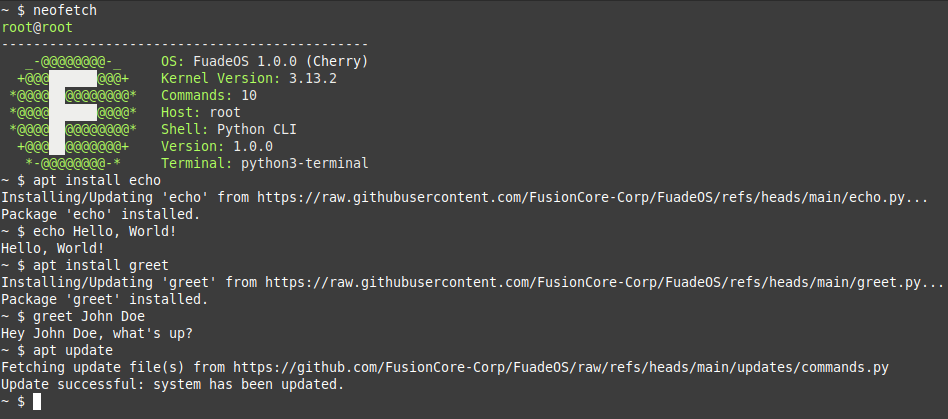

# FuadeOS
Python CLI "OS"

## There is only one release, which is the base system.
## After downloading, please run `apt update`to make sure the system is updated.

# Commands
Run `help` for a list of commands.

# Installing packages
run `apt install <package-name>` to install packages, such as:
- echo (print anything to the console)
> Usage: `echo <text>`
- greet (greet anyone)
> Usage: `greet <name>`

# Images

